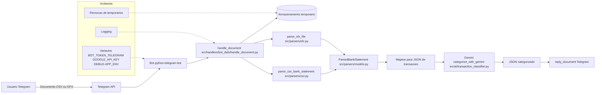

# Financial Categorizer Bot

## Sobre
Bot do Telegram que recebe extratos bancários em CSV/OFX, faz o parsing, converte para um formato único de transações, envia ao Google Gemini para categorização e devolve um arquivo JSON com o resultado.

Fontes: código neste repositório (`main.py`, `src/handlers/bot_defs/handle_document.py`, `src/parsers/csv.py`, `src/parsers/ofx.py`, `src/ai/transaction_classifier.py`) e documentação oficial das bibliotecas `python-telegram-bot` (`https://docs.python-telegram-bot.org/`), `google-generativeai` (`https://ai.google.dev/`), e `ofxtools` (`https://ofxtools.readthedocs.io/`).

## Sumário
- [Integração com Gemini](docs/GEMINI_INTEGRATION.md)
- [Manipulação no Telegram](docs/TELEGRAM_HANDLING.md)
- [Ambiente e Variáveis](docs/ENVIRONMENT.md)
- [Parsers de Extrato](docs/PARSERS.md)

## Diagrama
