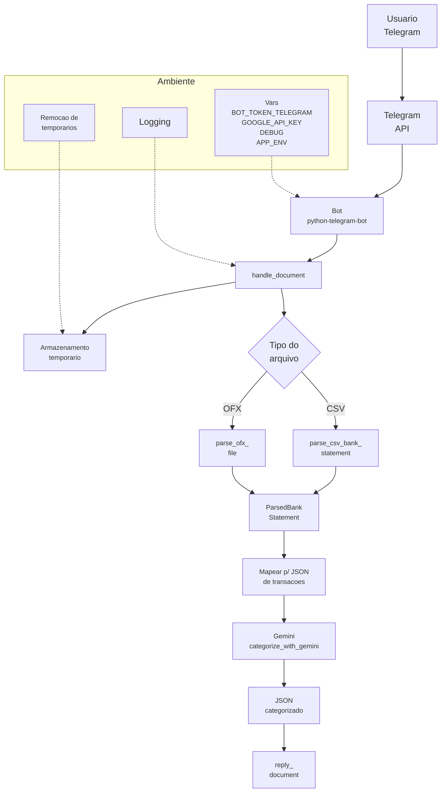

# Financial Categorizer Bot

## Sobre
Bot do Telegram que recebe extratos bancários em CSV/OFX, faz o parsing, converte para um formato único de transações, envia ao Google Gemini para categorização e devolve um arquivo JSON com o resultado.

## Sumário
- [Integração com Gemini](docs/GEMINI_INTEGRATION.md)
- [Manipulação no Telegram](docs/TELEGRAM_HANDLING.md)
- [Ambiente e Variáveis](docs/ENVIRONMENT.md)
- [Parsers de Extrato](docs/PARSERS.md)
 - [Deploy em EC2](docs/DEPLOY_EC2.md)

## Diagrama
